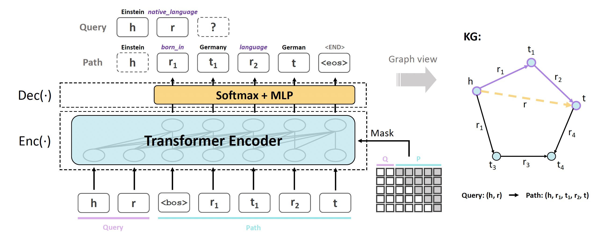

## S_cts

This is the improved codebase of the **SQUIRE** framework for multi-hop reasoning, proposed in [SQUIRE: A Sequence-to-sequence Framework for Multi-hop Knowledge Graph Reasoning](https://arxiv.org/abs/2201.06206).

## Overview
We present **SQUIRE**, the first **S**e**q**uence-to-sequence based m**u**lt**i**-hop **re**asoning framework, which utilizes an encoder-decoder structure to translate the triple query to a multi-hop path. Here is an overview of our model architecture:



This is the PyTorch implementation of our proposed model.

## Training SQUIRE
To reproduce our results or extend SQUIRE model to more datasets, follow these steps.

#### Generate training set
First generate mapping files and query-path pairs as training set with `utils.py` under `data/` folder, run the following command:
```
python utils.py --dataset FB15K237 --gen-mapping --gen-eval-data --gen-train-data --num 6 --out 6_rev --max-len 3
```
To run our model on new datasets, it suffices to provide `train.txt`, `valid.txt`, `test.txt` files.

If using *rule-enhanced learning*, first generate mapping files by running:
```
python utils.py --dataset FB15K237 --gen-mapping --gen-eval-data
```
Then, our model utilizes [AnyBURL](https://web.informatik.uni-mannheim.de/AnyBURL/) to mine logical rules. We provide a convenient script `run.sh` under `AnyBURL/` for mining and filtering high confidence rules (please modify the dataset name in `run.sh` and `config-learn.properties`). The above step helps generate `rule.dict` containing high quality rules under the dataset folder, or alternatively you can use the `rule.dict` files we've already generated for you. Then go to `data/` folder and run:
```
python utils.py --dataset FB15K237 --gen-train-data --num 6 --out 6_rev_rule --max-len 3 --rule
```
Note that we are currently using BFS to search for query-path pairs in training set, which might take up to an hour on our experiment datasets. We are planning to optimize our code for speed-up.
Then the positive sample pairs of each sample are obtained based on the rules and paths.

```
python utils.py --dataset FB15K237 --contrast --rule
```

#### Training and Evaluation
The following commands train and evaluate (on link prediction) SQUIRE model on all four datasets with GPU 0, where `--iter` is added to apply *iterative training* strategy during training. Check argparse configuration at `train.py` for details about each argument.
Remember to tune the vital hyperparameters, including `lr`, `num-epoch`, `label-smooth`, `prob` and `warmup`, so that SQUIRE can achieve promising performance on new datasets.

**FB15K237**
```
CUDA_VISIBLE_DEVICES=0 python train.py --dataset FB15K237 --embedding-dim 256 --hidden-size 512 \
    --num-layers 6 --batch-size 1024 --lr 5e-4 --dropout 0.1 --num-epoch 30 --save-dir "model_1" \ 
    --no-filter-gen --label-smooth 0.25 --encoder --save-interval 5 --l-punish --trainset "6_rev_rule" \ 
    --prob 0.15 --beam-size 256 --test-batch-size 8 --warmup 3 --iter
```

**NELL995**
```
CUDA_VISIBLE_DEVICES=0 python train.py --dataset NELL995 --embedding-dim 256 --hidden-size 512 \
    --num-layers 6 --batch-size 1024 --lr 1e-3 --dropout 0.1 --num-epoch 30 --save-dir "model_2" \
    --label-smooth 0.25 --encoder --save-interval 10 --l-punish --trainset "6_rev_rule" \
    --prob 0.15 --beam-size 512 --test-batch-size 2 --no-filter-gen --warmup 10 --iter --iter-batch-size 32
```

**FB15K237-20**
```
CUDA_VISIBLE_DEVICES=0 python train.py --dataset FB15K237-20 --embedding-dim 256 --hidden-size 512 \
    --num-layers 6 --batch-size 1024 --lr 1e-4 --dropout 0.1 --num-epoch 40 --save-dir "model_3" \
    --no-filter-gen --label-smooth 0.25 --encoder --save-interval 10 --l-punish --trainset "6_rev_rule" \
    --prob 0.25 --beam-size 256 --test-batch-size 4 --iter
```

**NELL23K**
```
CUDA_VISIBLE_DEVICES=0 python train.py --dataset NELL23K --embedding-dim 256 --hidden-size 512 \
    --num-layers 6 --batch-size 1024 --lr 5e-4 --dropout 0.1 --num-epoch 100 --save-dir "model_4" \
    --no-filter-gen --label-smooth 0.25 --encoder --save-interval 10 --l-punish --trainset "6_rev_rule" \
    --prob 0.15 --beam-size 512 --test-batch-size 4 --iter --iter-batch-size 32
```

To evaluate a trained model (for example, on FB15K237), run the following command. To apply *self-consistency*, add `--self-consistency` command and keep `beam_size = 512`. Add `--output-path` command to observe the top generated correct path by SQUIRE.
```
CUDA_VISIBLE_DEVICES=0 python train.py --test --dataset FB15K237 --beam-size 256 --save-dir "model_1" --ckpt "ckpt_30.pt" --test-batch-size 8 --encoder --l-punish --no-filter-gen
```

## Citation

Please cite our paper if you use our method in your work (Bibtex below).

```bibtex
@inproceedings{bai2022squire,
   title={SQUIRE: A Sequence-to-sequence Framework for Multi-hop Knowledge Graph Reasoning},
   author={Bai, Yushi and Lv, Xin and Li, Juanzi and Hou, Lei and Qu, Yincen and Dai, Zelin and Xiong, Feiyu},
   booktitle={EMNLP},
   year={2022}
}
```
